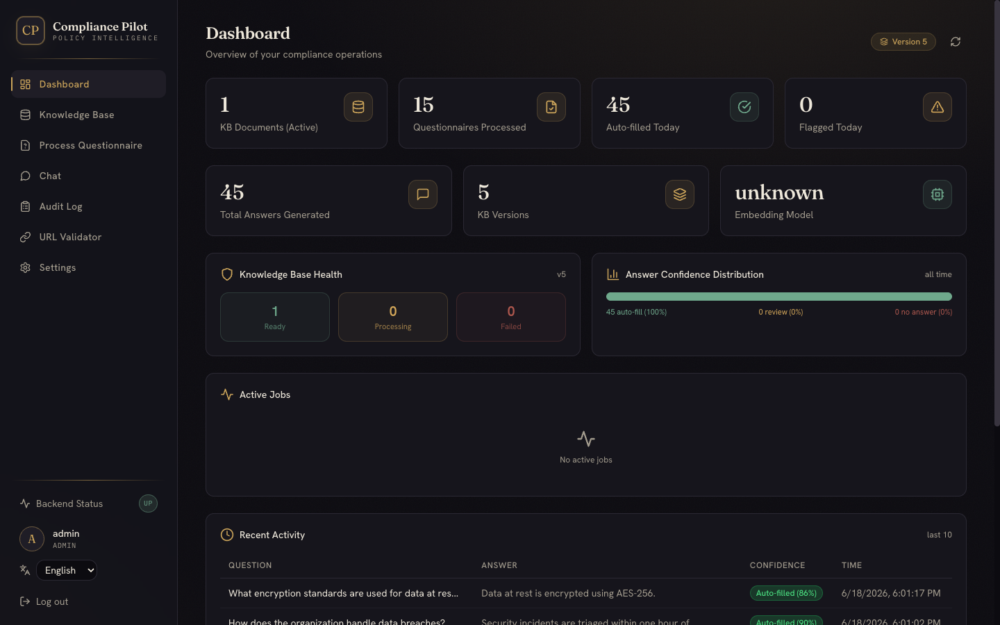
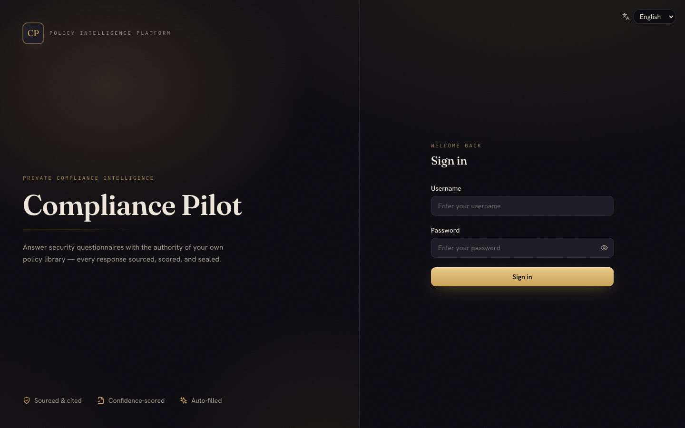
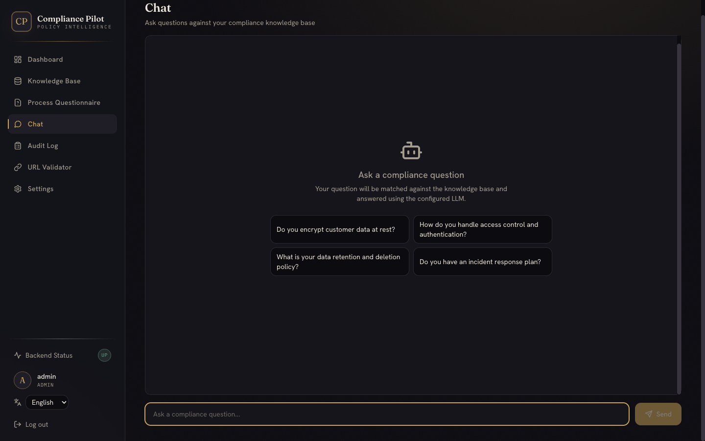
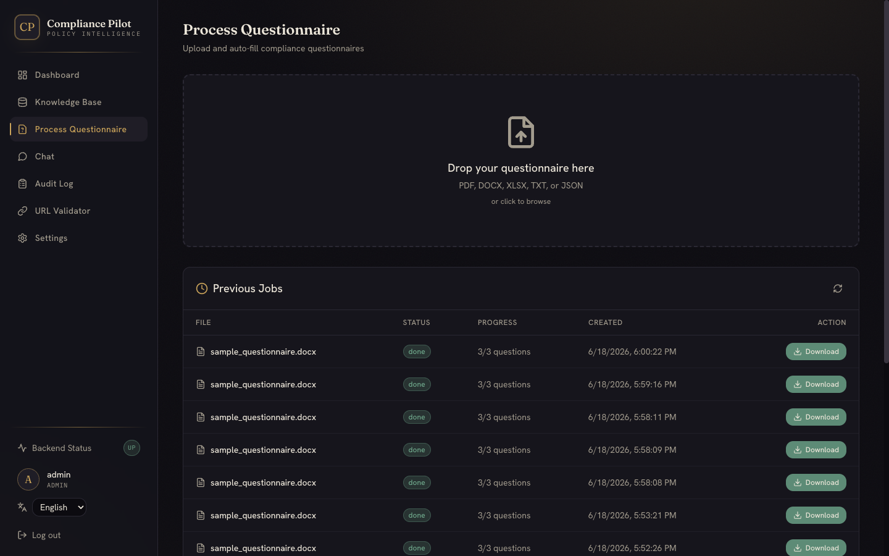
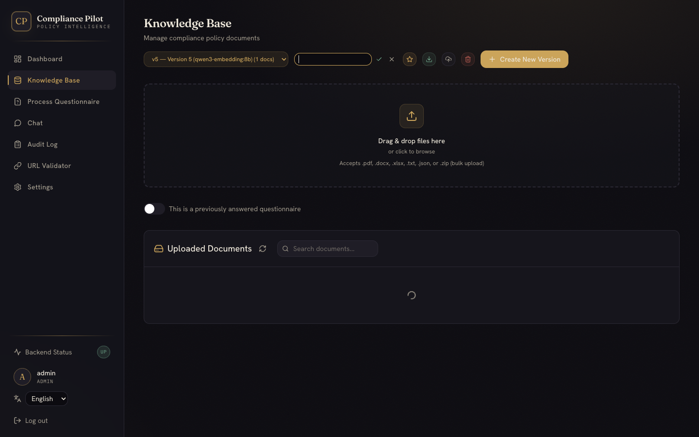
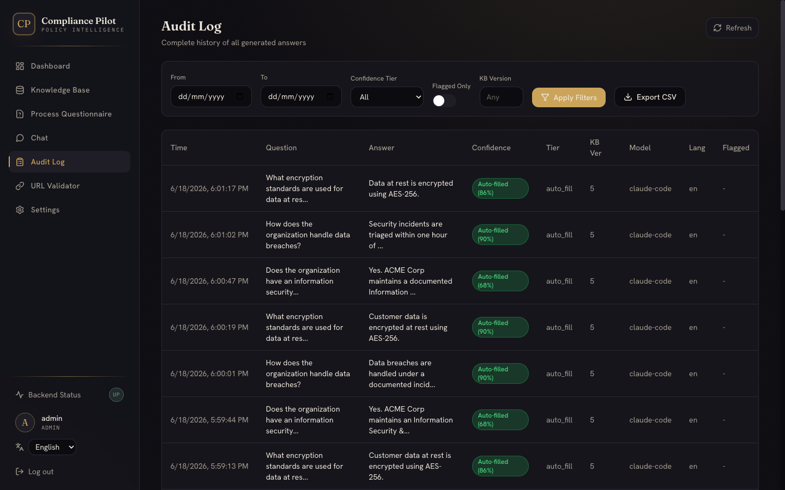

<div align="center">

# ✦ Compliance Pilot

### Answer security & compliance questionnaires with the authority of your own policy library — every response **sourced, scored, and sealed**.

[](LICENSE)


### [◆ Explore the live architecture deck →](https://pradeepkumar1611.github.io/compliance-pilot/architecture.html)

*An interactive walkthrough of the system — architecture, retrieval pipeline, security model, and the UI.*

</div>



---

**Compliance Pilot** is a self-hosted RAG (Retrieval-Augmented Generation) platform that automates the
soul-crushing work of filling out security questionnaires. Point it at your own policy documents, upload
a customer's questionnaire, and it reads every question, retrieves the best-supported answer from your
knowledge base, scores its confidence, and fills the answers back into the **original document** — format
intact — ready to download.

It runs **entirely on your own infrastructure**: a local vector database, local embeddings, and your choice
of a local LLM (the Claude Code CLI or Ollama). No questionnaire data leaves your machine.

## ✨ Features

- **Format-preserving auto-fill** — answers are written back into the original DOCX/XLSX/PDF, not a copy-paste dump.
- **Hybrid retrieval** — dense (`qwen3-embedding`) + sparse (BM42) vectors fused with RRF, plus LLM query expansion and re-ranking.
- **Confidence tiers** — every answer is graded *Auto-fill* / *Needs review* / *No answer* so humans focus only where it matters.
- **Cited answers** — responses carry source citations and reference URLs back to the originating policy.
- **Conversational Chat** — ask one-off compliance questions against the KB with sourced, confidence-scored replies.
- **Versioned knowledge base** — re-ingest and snapshot KB versions; roll forward without losing history.
- **Audit everything** — a full ledger of every answer with confidence, source, language, and timestamp; CSV export.
- **Secure by default** — httpOnly cookie auth + CSRF, role-based access, SSRF-guarded settings, rate-limited login.
- **Multilingual** — questions are detected, translated, answered, and translated back; UI ships with i18n.

## 📸 A look inside

| Sign in | Chat |
|---|---|
|  |  |

| Process a questionnaire | Knowledge base |
|---|---|
|  |  |

| Audit log |
|---|
|  |

## 🏗 How it works

```
            React + Vite (Tailwind)                 :5173
                      │  /api  (proxied)
                      ▼
        ┌─────────────────────────────────┐
        │        FastAPI  (async)          │         :9000
        │  Auth · Ingest · Retrieve        │
        │  Extract · Fill · Audit          │
        └───┬───────────┬───────────┬──────┘
            │           │           │
      ┌─────▼───┐  ┌────▼─────┐ ┌──▼───────┐
      │ Qdrant  │  │  Ollama  │ │  SQLite  │
      │(vectors)│  │(embeds + │ │ (audit · │
      │  :6333  │  │  LLM)    │ │  jobs)   │
      └─────────┘  │  :11434  │ └──────────┘
                   └──────────┘
            (LLM may instead be the local `claude` CLI)
```

1. **Ingest** — policy docs are parsed (IBM Docling for PDF/DOCX/XLSX; fast paths for txt/md/json), chunked by section, embedded, and stored in Qdrant with both dense and sparse vectors.
2. **Extract** — an uploaded questionnaire is parsed and every question is detected (LLM-assisted, heuristic fallback).
3. **Retrieve** — each question is expanded, hybrid-searched, re-ranked, and answered by the LLM using only retrieved context.
4. **Score & fill** — the answer is confidence-tiered and written back into the source document; everything is logged to the audit trail.

## 🧰 Tech stack

| Layer | Technology |
|---|---|
| Backend | Python 3.11 · FastAPI (async) · SQLAlchemy + aiosqlite |
| Vector DB | Qdrant (dense + sparse hybrid search, RRF fusion) |
| Embeddings | Ollama `qwen3-embedding:8b` (dense) · FastEmbed BM42 (sparse) |
| LLM | Claude Code CLI (default) or Ollama (`llama3.2`, configurable) |
| Doc parsing | IBM Docling · python-docx · PyMuPDF · openpyxl |
| Auth | JWT in httpOnly cookies + CSRF · bcrypt |
| Frontend | React 18 · Vite · Tailwind CSS · Radix UI · i18next |
| Tests | pytest (97) · Playwright (44, end-to-end) |

## 🚀 Quick start

### Prerequisites
- Python **3.11+**, Node **18+**
- [Ollama](https://ollama.ai) (for embeddings)
- A vector store: Docker (or [colima](https://github.com/abiosoft/colima)) to run Qdrant
- An LLM: the [Claude Code CLI](https://docs.claude.com/claude-code) **or** an Ollama chat model

### 1. Install
```bash
make install          # backend venv + pip, frontend npm, Playwright browsers
# or manually:
cd backend && python3.11 -m venv .venv && .venv/bin/pip install -r requirements.txt
cd ../frontend && npm install
```

### 2. Pull the embedding model & start services
```bash
ollama pull qwen3-embedding:8b
docker run -d --name qdrant -p 6333:6333 -v "$PWD/qdrant_storage:/qdrant/storage" qdrant/qdrant
# (LLM) either have the `claude` CLI on PATH, or: ollama pull llama3.2
```

### 3. Run
```bash
make dev
# Backend  → http://localhost:9000  (API docs at /docs)
# Frontend → http://localhost:5173
```

### 4. Sign in
Open **http://localhost:5173** and log in with the seeded admin:

> **Username:** `admin`  **Password:** `admin123` — you'll be prompted to change it on first login.

## ⚙️ Configuration

All settings have sane defaults and can be set via environment variables (see [`.env.example`](.env.example))
or, at runtime, from the in-app **Settings** page (admin only). Highlights:

| Setting | Default | Notes |
|---|---|---|
| `LLM_PROVIDER` | `claude_code` | or `ollama` |
| `EMBED_MODEL` | `qwen3-embedding:8b` | served by Ollama |
| `QDRANT_URL` | `http://localhost:6333` | |
| `JWT_SECRET` | _(unset)_ | **set a strong value** — `openssl rand -hex 32` |
| `APP_ENV` | `development` | `production` enforces a strong JWT secret |
| `CORS_ORIGINS` | `http://localhost:5173` | comma-separated |

## 🧪 Testing

```bash
make test-backend     # 97 pytest tests (mocked — no Ollama/Qdrant needed)
make test-ui          # 44 Playwright end-to-end tests (needs the full stack running)
```

## 📂 Project structure

```
backend/          FastAPI app — ingest, retriever, extractor, filler, auth, audit
frontend/         React + Vite SPA (Tailwind, i18n)
tests/            pytest (backend/) + Playwright (ui/) + fixtures
docs/             architecture & deep-dive docs + screenshots
docker-compose.yml, Makefile
```

## 📝 License

MIT — see [LICENSE](LICENSE).
